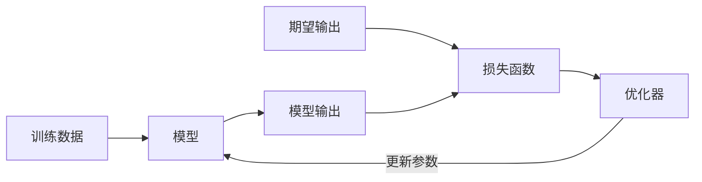

---
# try also 'default' to start simple
theme: seriph
# apply any windi css classes to the current slide
class: 'text-center'
# https://sli.dev/custom/highlighters.html
highlighter: shiki
# show line numbers in code blocks
lineNumbers: true 
# persist drawings in exports and build
drawings:
  persist: false
# page transition
transition: slide-left
# use UnoCSS
css: unocss
---

<style>
.slidev-layout {
  font-family: sans-serif;
}

.slidev-layout.cover {
  color: black !important;
  background: white !important;
  background-image: unset !important;
}
.slidev-layout.cover p {
  color: black !important;
}

.slidev-layout h1 {
  color: #005cc5 !important;
  font-weight: bold;
  border-bottom: solid 2px #005cc5;
  width: fit-content;
}
.slidev-layout h2 {
  font-size: 1.6rem;
  margin-bottom: 10px;
}
.slidev-layout .my-auto h1 {
  color: #005cc5 !important;
  border-bottom: none;
  width: auto;
}
.slidev-layout h1 + p {
  opacity: 1 !important;
  padding-top: 20px;
}
.col-right {
  padding-left: 25px;
  display: flex;
  justify-content: center;
  flex-direction: column;
}
</style>

# AI 学习时间

关键词：#训练 #损失 #批学习 #学习率 #大模型预训练

2025-04-16 (第4课) @矩阵前端研发二组

---

# 复习

- **训练**：通过不断地尝试，来得到模型的参数。



- **数据集**：包含了我们希望模型学习的样本。
- **损失函数**：接受模型的输出和我们期望的输出，然后输出一个损失值。
- **优化器**：接受损失函数的输出，然后输出一个新的模型。

---

# 复习

- **大模型**：一个将输入转换为输出的函数，本质是一系列向量变换的组合

    ```ts
    const output = Model(input)
    ```

- **大语言模型**：是概率模型，预测给定上下文的下一个词，条件概率表示为

$$
p(w_1, \dots, w_m) = \prod^m_{t = 1} P(w_t | w_1, \dots, w_{t - 1})
$$

---

# 训练

对于一个模型的训练，是寻找最优的参数的过程，使得模型的输出尽可能接近我们期望的输出。下面是模型训练的一次循环。

```ts
const model = new Model()
// 计算当前结果
const output = model(input)
// 计算当前结果与期望结果之间的损失
const loss = Loss(output, target)
// 通过损失计算优化方向
const optimizer = Optimizer(loss)
// 优化模型
const newModel = optimizer.update(model)
```

在这个流程中有几个关键问题：

- 损失是如何衡量的？
- 模型的参数是怎样更新的？

---
layout: two-cols
---

# 例子 - 数据集

假设现在有这些数据，我们需要找到一个模型，使得

- 这个模型能尽可能拟合这些已知数据
- 这个模型能比较好预测未来的数据

::right::


---
layout: two-cols
---

# 例子 - 目标函数

从这个简单的数据集，我们可以看到这些数据点“貌似”是在一条直线上的。当然，事先知道这个答案可能会对我们的理解更有利。这个目标函数是 $y = 2x$。

::right::


---
layout: two-cols
---

# 例子 - 建模与误差

假设我们事先不知道这个答案是 $y = 2x$，我们也不能对问题一无所知，通过数据猜测（或者说建立）背后的模型，也是需要一定的洞察力和方法的，但我们先跳过这个“建模”的技巧说明，先聚焦于深度学习训练这个课题。假设我们已经有一定的洞察力了，知道这是一条直线。

$$
y = ax
$$

我们先对 $a$ 值进行一个盲猜，假设我们猜 $a = 1$，我们通过一个整体误差来衡量这个猜测。

$$
\text{loss} = \sum_{i=1}^n \big[y_i^\text{data} - y_i^\text{model(a=1)}\big]^2
$$

::right::


上图展示的虚线长度（一般为了方便是用长度的平方）总和就是 $a = 1$ 时模型产生的整体误差。

---
layout: two-cols
---

# 例子 - 建模与误差

$$
\text{loss} = \sum_{i=1}^n \big[y_i^\text{data} - y_i^\text{model(a=1)}\big]^2
$$

由于我们知道答案，所以可以想一个办法让 $a$ 慢慢靠近正确答案 $a = 2$，但是作为一个通用的方法，我们需要有一种通用的方式来更新参数。观察上面的公式，里面的两个变量

- $y^\text{data}_i$ 是已知的数据
- $y^\text{model}_i$ 是模型的输出，也就是 $f(x^\text{data}_i) = a x^\text{data}_i$

整个公式里，只有 $a$ 一个未知变量，所以当整体误差展开的时候，是一个一元二次方程，并且二次项符号是正的。由于上标均变为 `data`，所以下面省略上标。

::right::

$$
\begin{align*}
\text{loss} &= \sum_{i=1}^n \big[y_i - ax_i\big]^2 \\
&= \sum_{i=1}^n \big[y_i^2 + ax_i^2 - 2 a y_i x_i\big] \\
&= \sum_{i=1}^n y_i^2 + \sum_{i=1}^n a^2 x_i^2 - \sum_{i=1}^n 2 a x_i y_i \\
&=
  + \color{blue}\sum_{i=1}^n  x_i^2 \color{black} a^2
  - \color{blue}\sum_{i=1}^n 2 x_i y_i \color{black} a
  + \color{blue}\sum_{i=1}^n y_i^2 \\
\end{align*}
$$

---
layout: two-cols
---

# 例子 - 建模与误差

既然是一个一元二次方程，开口向上，那么它就会存在一个最低点，因为我们知道正确答案是 $a=2$，所以这个抛物线的顶点，就是在 $(2, 0)$ 这个位置。

::right::


---
layout: two-cols
---

# 例子 - 损失函数与学习

上述讨论还揭示了一点，整体损失 $\text{loss}$ 实际上是关于模型参数 $a$ 的一个函数 $\text{loss} = f(a)$，这意味着，当我们通过调整 $a$ 让 $\text{loss}$ 达到最小值，那么此时的 $a$ 就是我们需要的模型参数了。

有了上面的认知与工具，我们就可以开始考虑如何更新参数了。在上面的例子中，我们一开始猜测 $a = 1$，此时我们得到一个误差，但此时并没有任何信息告诉我们，应该往哪个方向调整 $a$ 的值，究竟是尝试 $a = 1.5$ 还是 $a = 0.5$（假设更新步长是 $0.5$）。此时我们不用决策，随机找一个方向，通过**误差的变化**来指导下一步的操作。

从上图我们可以看到，当 $a$ 变大到 $1.5$ 的时候，整体误差变小了，所以这个方向是正确的，于是我们可以继续往这个方向调整。

::right::


---
layout: two-cols
---

# 例子 - 损失函数与学习

考虑到**方向性**的问题，如果我们要判断方向，是需要一些“标记”的，观察这个典型的抛物线图，往上误差增大，往下误差减小，当从一个位置向上下移动的时候，刚好可以通过符号来判断。

**导数**就是用来衡量这种变化的一种方式，回顾一下对于一元二次方程的导数，是以下的形式

$$
\begin{align*}
y &= ax^2 + bx + c \\
y' &= 2ax + b
\end{align*}
$$

对于上面的损失函数来说，我们把 $y_i = 2x_i$ 也代入，会得到

::right::

$$
\begin{align*}
\text{loss} &= \sum_{i=1}^n \big[y_i - ax_i\big]^2 \\
&= \sum_{i=1}^n \big[2x_i - ax_i\big]^2 \\
&= \sum_{i=1}^n  x_i^2  a^2
  - \sum_{i=1}^n 4 x_i^2  a
  + \sum_{i=1}^n y_i^2 \\
\frac{\partial \text{loss}}{\partial a}
&= 2\sum_{i=1}^n  x_i^2  a
  - 4\sum_{i=1}^n x_i^2 \\
&= 2Ca - 4C \text{(把常数换为} C \text{)}
\end{align*}
$$

从这个公式可以看到，当 $a = 2$ 的时候，导数为 0，也就是这个点是这个函数的极值点，也就是我们需要的最小值。

---
layout: two-cols
---

# 例子 - 损失函数与学习

但假设我们将这个抛物线看成是一个现实中的斜坡，那参数更新的过程可以看成是从某一个位置释放一个小球，这个小球会随着重力的作用往下滚动，如果这个斜坡还是有阻尼的话，那么这个小球最终会停下来，也就是这个参数更新最终会使得误差为 0，当然，这是非常理想的情况。但可以想象到的是，通过这种方式，是可以找到最优解的。

右边展示的是另一种更新的可能，虽然看着在最优值之间来回跳动，但是只要向着损失最小化的方向，最终还是有机会到达最优点。

::right::


--- 
layout: two-cols
---

# 例子 - 学习率与参数更新

进一步看，$a$ 在抛物线两边变动的时候，导数的变动方向刚好和误差的变动方向是一致的（大家可以验证下），而误差是 $a$ 的函数 $\text{loss} = f(a)$，对这个函数求导，实际上表明了 $a$ 的变化会如何导致误差的变化，**这两者的变化是同步的**。而我们的目标是让误差最小，所以可以通过导数反过来指导 $a$ 的变化。

这意味着 $a$ 的更新可以写成

$$
a \gets a - \text{loss}'
$$

理论上这个公式就可以作为参数的更新方式了，但是考虑到误差的导数是不可控的，如果我们希望控制更新的步长，此时我们需要引入一个 **学习率（learning rate）** 的参数，用来“限制”变动的比例。

$$
a \gets a - \color{blue}\eta \color{black}\text{loss}'
$$

::right::


---
layout: two-cols
---

# 例子 - 小批量学习

在上面的例子中，我们是使用一堆数据点的误差总和进行学习的，这其实已经属于 **批量学习（batch learning）** 的范畴。先考虑一下，一个个点进行学习会产生什么问题。

从上图可以看到，过一点其实会有无数条直线，这意味着过这一点能够找到无数个函数，使得误差为 $0$，这相当于我们的模型可以有无数个解，以至于无法学习。但当我们选取一小部分的点一起训练，情况就不同了。

::right::


---
layout: two-cols
---

# 例子 - 小批量学习

从上图可以看到，如果是一次计算几个点的误差，那么这几个点到红色直线（目标函数）的损失为 $0$，而这几个点到绿色和蓝色直线的误差都比较大，所以如果我们的建模“比较准确”的话，通过几个点一起训练可以大大增加学习的准确率。

::right::


---

# 大语言模型的预训练

语言模型的内在逻辑是概率模型，也就是给定一个上文，得到一个下文的概率分布。大语言模型的预训练，就是为了学习这个概率分布。而这个概率分布的目的，是为了预测下一个词。

通过上面的例子，我们已经知道一个训练过程的关键要点，接下来我们可以逐个环节来看大语言模型是如何训练的。

---
layout: two-cols
---

# 预训练 - 数据集

在上面的例子中，由于输入和输出都是数字，然后模型是一个简单的线性函数，所以我们很容易理解这些数字和函数在后面的流程是如何被使用的，到了大语言模型这个语境里，输入 $x$ 是什么？输出 $y$ 又是什么？

直观来看，由于大语言模型是用来预测下一个词的，那么“下一个词”，自然就是我们所希望的 $y$，而它的上文，就是对应的 $x$。假如我们有这样一个语料（这个语料很简陋，只有一句话）。

> 今天天气很好

::right::

那么我们可以构造以下数据。

| data ID | $x$ | $y$ |
| ------- |-----|-----|
| d0 | BEGIN | 今 |
| d1 | 今 | 天 |
| d2 | 今天 | 天 |
| d3 | 今天天 | 气 |
| d4 | 今天天气 | 很 |
| d5 | 今天天气很 | 好 |
| d6 | 今天天气很好 | END |

---

# 预训练 - 数据集

这种构造数据的方法，称为**自监督的预训练**。因为全程无需人类标注，只需要有语料库，就能通过字符串处理构造出一堆的原始训练数据，所以称为自监督。当然，实际的切割方法还有不少讲究的地方，但是暂时不深入过多，需要稍微注意的一点是，让大模型学会何时终止也是非常重要的，所以在句末需要加上一个特别的占位符 `END`。（句首同理）。


上图也展示了另一种构造数据的方式，通过对一个句子进行挖空，然后让大模型来填空，注意挖空处的标记。这种挖空的训练任务称为**去噪自编码**。

---
layout: two-cols
---

## 预训练 - 建模

给大语言模型建模，当然不是一件简单的事情。下面是目前主流的基于 transformer 架构的大语言模型架构图。这样图比较出名，大家可能不止一次看到过。

这个架构后面会详细解释，相信到时候大家也会明白为什么是这样的设计，以及里面的细节与原理，不过现在暂时不深入，因为并不影响理解，这个复杂的架构，与上面例子里的 $y = f(x) = ax$ 并没有本质的区别，这个架构无非就是多了很多层的函数以及循环而已。

但这个图值得我们注意的一点是，最后的输出是**输出概率**。

::right::


---
layout: two-cols
---

## 预训练 - 损失

在上面的例子里，由于输出是一个数值，而数据里也是数值，所以我们可以很直观地使用两者之间的距离作为损失的衡量。但大模型最后一步输出的是一个概率分布，那该如何拿这个概率分布，与我们期望的概率分布进行对比并计算损失呢？

假设上图是“今天天气很”的大语言模型输出，在这个上文下，理论上“好”的概率应该是最高的，因为这句话和其他几个字都不太搭，但大模型却给出了“天”是最高概率，这与我们的期望是不一致的。而且从上面的数据中，`d5` 这个数据（`['今天天气很', '好']`）的答案也是“好”，所以我们需要一种方法来描述这种认知差别，也就是我们希望的分布应该是这样的。

::right::


---
layout: two-cols
---

## 预训练 - 损失

数学上有一种叫做**交叉熵（cross entropy）误差**的方法用于描述两个概率分布之间的差异，计算方式为

$$
E = -\sum_{w \in \mathcal{V}}^n p(w) \log q(w)
$$

其中 $p$ 是我们期望的概率分布，$q$ 是大模型输出的概率分布，$n$ 是概率分布的维度（在这个例子中就是词汇表单词的数量）。通过这种方式，我们也将误差转化为一个数值了，就可以用上面的老办法来进行训练了。

::right::


---

# 小结

- **训练**：训练是寻找让误差最小的一组参数的过程。
- **数据集**：数据集给出一组输入输出，让模型通过学习来得到一组参数。
- **损失**：损失是模型参数的函数，用来衡量当前模型的参数造成的整体误差。
- **学习率**：可以通过对损失函数求导来更新参数，但是通常会乘以一个比率来控制参数变化粒度。
- **大语言模型预训练**：采用一种自监督的学习方式来学习语言模型。
- **预训练数据**：通过构造上下文的方式来构造训练数据。
- **交叉熵误差**：用来衡量两个概率分布之间的差异。

---

<div style="display: flex; width: 100%; height: 100%; justify-content: center; align-items: center">
  <h1 style="font-size: 3em;">Q & A</h1>
</div>
