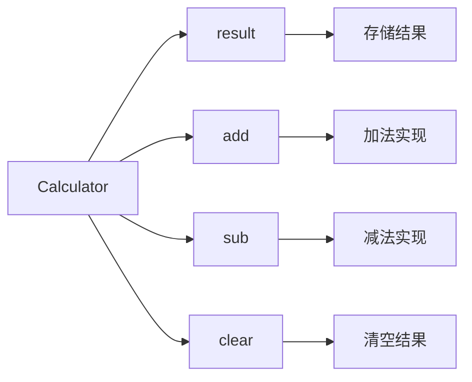
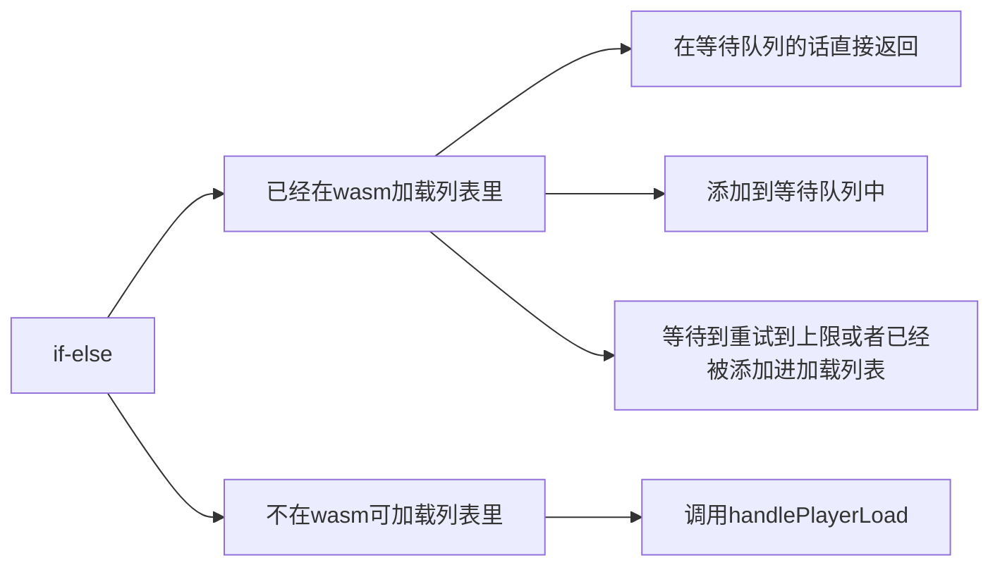

---
# try also 'default' to start simple
theme: seriph
# apply any windi css classes to the current slide
class: 'text-center'
# https://sli.dev/custom/highlighters.html
highlighter: shiki
# show line numbers in code blocks
lineNumbers: true 
# persist drawings in exports and build
drawings:
  persist: false
# page transition
transition: slide-left
# use UnoCSS
css: unocss
---

<style>
.slidev-layout {
  font-family: sans-serif;
}

.slidev-layout.cover {
  color: black !important;
  background: white !important;
  background-image: unset !important;
}
.slidev-layout.cover p {
  color: black !important;
}

.slidev-layout h1 {
  color: #005cc5 !important;
  font-weight: bold;
  border-bottom: solid 2px #005cc5;
  width: fit-content;
}
.slidev-layout h2 {
  font-size: 1.6rem;
  margin-bottom: 10px;
}
.slidev-layout .my-auto h1 {
  color: #005cc5 !important;
  border-bottom: none;
  width: auto;
}
.slidev-layout h1 + p {
  opacity: 1 !important;
  padding-top: 20px;
}
.col-right {
  padding-left: 25px;
  display: flex;
  justify-content: center;
  flex-direction: column;
}
strong {
  color: #005cc5;
}
</style>

# 202509 iRead 答疑会

关键词：#可读性 #AI #CR #架构

2025-11-04 @bifnudozhao

---

# 简要

- 代码可读性
- AI时代下的 iRead 考试

---

# 代码可读性

代码本质是一行一行的文本

```ts
class Calculator {
  result: number = 0

  add(x, y) {
    const result = x + y
    this.result = result
    return result
  }

  sub(x, y) {
    const result = x - y
    this.result = result
    return result
  }

  clear() {
    this.result = 0
  }
}
```

---
layout: two-cols
---

# 代码可读性

理解的本质是对代码文本的结构化重构

```ts
class Calculator {
  result: number = 0

  add(x, y) {
    const result = x + y
    this.result = result
    return result
  }

  sub(x, y) {
    const result = x - y
    this.result = result
    return result
  }

  clear() {
    this.result = 0
  }
}
```

::right::

一行行的代码需要再重新组织为树状结构帮助理解。为什么层次结构方便理解？



---
layout: two-cols
---

# 代码可读性

```ts
if (!wasmCanLoadList.includes(index)) {
  if (wasmWaitLoadList.includes(index)) return;
  wasmWaitLoadList.push(index);
  waitUtil(() => {
    wasmRetryTime = wasmRetryTime - 1;
    return wasmCanLoadList.includes(index) || wasmRetryTime <= 0;
  }).then(() => {
    wasmRetryTime = 10;
    if (!wasmCanLoadList.includes(index)) {
      handleError(index);
      return;
    }
    const delIndex = wasmWaitLoadList.indexOf(index);
    wasmWaitLoadList.splice(delIndex, 1);
    if (!wasmCanplayList.includes(index)) {
      videoRefs[index].current?.video.current?.handlePlayerLoad();
    }
  });
} else {
  if (!wasmCanplayList.includes(index)) {
    videoRefs[index].current?.video.current?.handlePlayerLoad(true);
  }
}
```

::right::

即使对于复杂逻辑，我们也不可能单纯靠通读代码直接理解，在读代码的过程中，我们实际上是对代码进行了结构化理解。



---

# 代码可读性

写代码的过程，是前面过程的逆过程。我们实际上是把思维中的逻辑结构，转化为代码。这个转化，实际上满足“某种”树的遍历过程。


刚才从一行一行的代码达到理解的过程，实际上是通过一个树遍历的结果，把树重构回来的过程。


代码可读性高的代码，实际上就是这两个过程转化非常顺畅，写出高可读的代码的过程，就是比较严格遵循理解树到代码的转化过程。这样当读者读代码的时候，可以直接通过树的遍历顺序把结果重构回来。

---

# 代码可读性

可读性低的代码是什么？

从上面的设定来看，任何影响上述过程的因素，都会产生可读性低的代码。下面对一些常见的可读性问题进行说明（只是举例子，没有全部包含）：

- 命名：不知道放到树的哪个结构里
- 顺序：需要多次遍历树的某个节点，才能把内容全部放进去
- 简洁逻辑：通过一个简单节点能够概括的逻辑，变成需要深入几层才能表示
- if-else嵌套过深：导致树结构过于复杂
- 惯用法：写法不符合规范，本身需要动用知识范围外的思考才能转化为树节点
- 等等

---

# 代码可读性

既简单又困难的 iRead 考试

按照上面的思路，其实考试的时候只要把理解过程中觉得困惑的点列出来，基本上就能通过考试。

1. 将代码转变为理解树
2. 记录下树构建过程中遇到的困难（理解问题，低可读）

但这里有两个前提

1. 理解思路必须是大众思路，并不是很独特很绕弯的思路
2. 具备一定的专业知识（基本代码规范，语言规范，设计规范）

---

# AI时代下的 iRead 考试

iRead 考试的初衷以及基本目标是希望大家能写出简洁清晰的代码。能写出简洁清晰的代码意味着能找出代码中的可读性问题。

AI时代下，代码是AI写的，CR也是AI做的，开发还有必要掌握这种技能吗？

---

# AI时代下的 iRead 考试

AI 写代码的问题

- 通过一系列不长，但是没有必要，或者说通用性不高的条件判断来满足描述要求
- 单测的时候直接 mock 数据跑代码，完全脱离项目的类型定义以及常量定义
- 架构比较线性，不利于长期维护

AI CR的好处

- 有时候确实可以从 AI CR 中学习到不少细节问题
- AI CR 有可能错，锻炼自己的辨别能力

---

<div style="display: flex; width: 100%; height: 100%; justify-content: center; align-items: center">
  <h1 style="font-size: 3em;">Q & A</h1>
</div>
