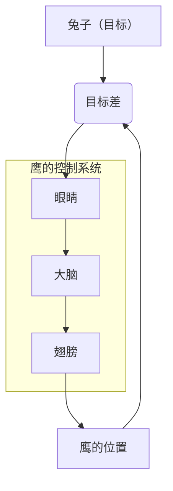
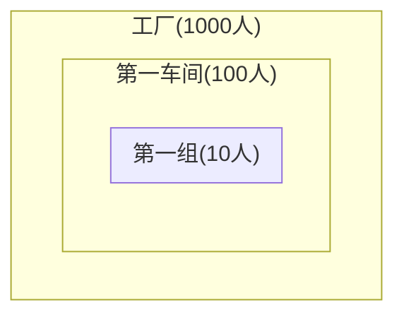
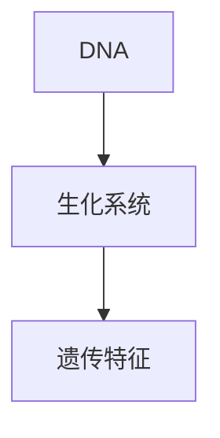
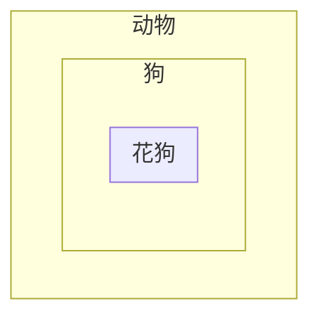
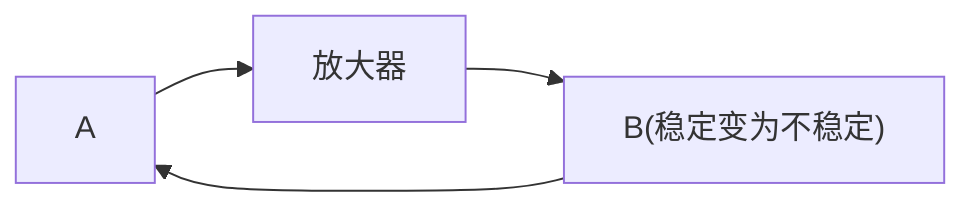
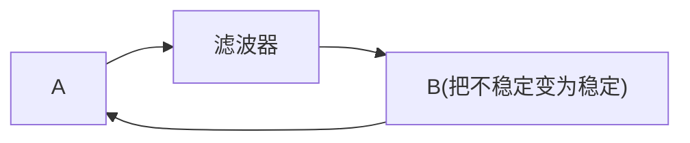
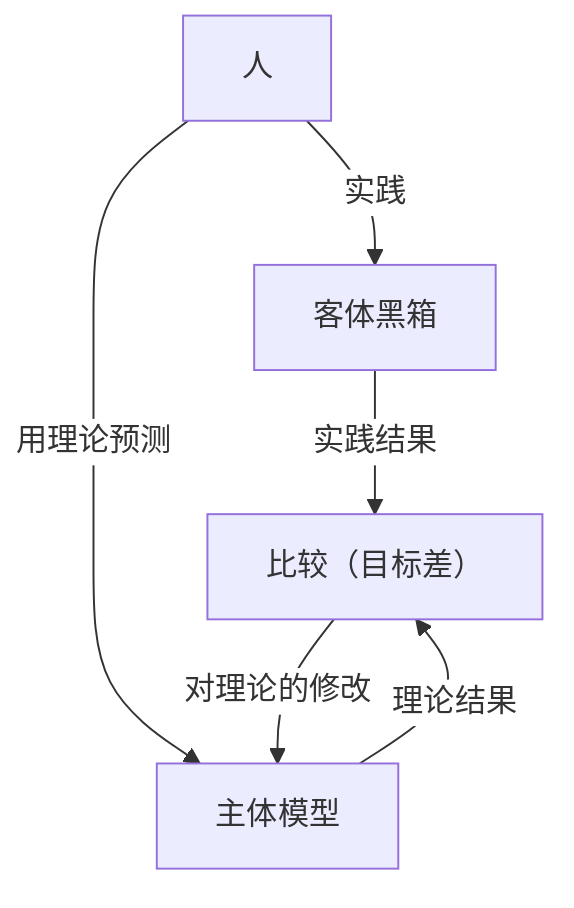

---
# try also 'default' to start simple
theme: seriph
# apply any windi css classes to the current slide
class: 'text-center'
# https://sli.dev/custom/highlighters.html
highlighter: shiki
# show line numbers in code blocks
lineNumbers: true 
# persist drawings in exports and build
drawings:
  persist: false
# page transition
transition: slide-left
# use UnoCSS
css: unocss
---

# 控制论与科学方法论

关键词：#控制 #负反馈 #可能性空间 #系统 #稳态 #认识论 #黑盒

2025-08-29 @矩阵前端研发二组

---
layout: two-cols
---

# 简要

- 控制和反馈
- 信息、思维和组织
- 系统及其演化
- 黑箱认识论

::right::

作者: 金观涛

---

# 控制与反馈 - 可能性空间

控制论和系统论的研究开始于**可能性空间**。

控制论是关于控制的理论，控制过程有一些共有的特征：

- 被控制的对象必须存在着多种发展的可能性。
- 人可以在可能性中通过一定的手段进行选择，才谈得到控制。

由此可见，控制的概念与事物发展的可能性密切相关。我们将*事物发展变化中面临的各种可能性集合称为这个事物的可能性空间*。

---

# 控制与反馈 - 人通过选择改造世界

事物的矛盾性，使事物的可能性空间至少面临着肯定自身和否定自身两种状态。从不确定性的角度来看待事物的发生和发展，是现代科学和经典决定论的一个重要区别。

事物发展的可能性空间，或事物的不确定性，是由事物内部的矛盾决定的。人们根据自己的目的，改变条件，使事物沿着可能性空间内某种确定的方向发展，就形成控制。控制，归根结底是一个在事物可能性空间中进行有方向的选择的过程。

一切的控制过程，实际都是由三个基本环节构成的：

1. 了解事物面临的可能性空间是什么。
2. 在可能性空间中选择某一些状态为目标。
3. 控制条件，使事物向既定的目标转化。

---

# 控制与反馈 - 控制能力

对于绝大多数控制过程，人们并不是把事物的可能性空间精确地缩小到某个**惟一的状态**，而只是把可能性空间缩小到一定的范围就达到控制的目的了。如果任何控制过程都想以某个惟一状态为目标，不但没有必要，而且还会使控制失灵。

每一次控制后，事物发展的可能性空间缩小了。可能性空间缩得越小，标志着我们的控制能力越强。更一般地，我们把实行控制前后的可能性空间之比称为**控制能力**。如果一个事物的可能性空间为 $M$，实行控制后，可能性空间缩小为 $m$，那么控制能力就是 $M/m$。

---

# 控制与反馈 - 随机控制

碰运气的方法，称为“**随机控制**”。

控制就是可能性空间的缩小，随机控制也是可能性空间缩小的过程，但是在随机控制过程中，系统的可能性空间只有在达到目标值时才缩小。

比如我们要进一个上了锁的房间，手里有一大串钥匙，但不知道其中哪一把能把锁打开。人们最常用的方法就是“一个一个试试看”

随机控制有如下特点：

- 如果随机控制的对象可能性空间很大，就有一个选择速度的问题。
- 随机控制要有效，那目标必须包含在探索的范围之内。

在随机控制中，不断地扩大和改变探索范围是很重要的。

> 许多大理论家，大发明家之所以高人一等，往往在于甩开了世俗的偏见，在一般人想不到的领域创造了奇迹。

---

# 控制与反馈 - 有记忆的控制

随机控制的缺点是如果碰不巧，需要花费很长的时间才能碰上目标。一个最常用的改进办法便是增加一个记忆装置，**使随机控制成为有记忆的**。

所谓一个选择者具有记忆力，就是指，凡被证明不是目标的状态就不再当作选择对象了，这些状态将从下一个可能性空间中排除出去。与无记忆的控制比较，有记忆的控制的可能性空间在达到目标值之前是随着选择次数逐一缩小的。

---
layout: two-cols
---

# 控制与反馈 - 负反馈调节

鹰在捕食的时候，不可能可以预测目标的行动路径，所以它其实是在追踪的过程不断调整。大脑的决定始终使鹰向目标差缩小的方向运动。

**负反馈调节**的本质在于设计了一个目标差不断减少的过程。一般的负反馈调节机制必定有两个环节：

1. 系统一旦出现了目标差，便自动出现某种减少目标差的反应。
2. 减少目标差的调节要一次次发挥作用，使得对目标的逼近能积累起来。

::right::

---

# 信息、思维和组织 - 什么是知道

所谓“**知道**”，是指人类获得信息的过程，而怎样才能“知道”，就是信息怎样传递，怎样获得信息的过程。而我们也可以把“知道”，或者说获得信息的过程，看做人们对事物可能性空间了解程度发生了变化的过程。

一般用负对数表示信息量，也就是

$$-\log(100/1000) = -\log(1/10)$$

**用负对数的好处在于，信息量可以直接相加**。假如此时第一车间的人告诉他熟人在第一组，而第一组有10人，那么信息量为 $-\log(10/100) = -\log(1/10)$，这样总信息量为 $-\log(10/1000) = -\log(1/10) -\log(1/10)$。

---

# 信息、思维和组织 - 信息的传递

信息之所以称为信息，就是它的可传递性。传递信息有几个重要的环节，一个称为**信息源**，一个称为信息的**接受者**。在信息源和接受者之间还必须存在传递信息的通道，**信息通道**把信息源“发生了什么事件”传递给接受者。信息在传递过程中的形式称为**信号**。

信息的传递是指**可能性空间缩小过程的传递**。

DNA 结构可能性空间，通过生化系统的信息传递，变化为遗传特征的可能性空间。

---

# 信息、思维和组织 - 信息加工和思维

我们的大脑跟体内其他器官有一个显著的区别，它的主要职能不是加工物质，也不是加工能量，而是加工信息的。大脑也不同于感官，单纯起一种传递信息的通道作用。我们通过感官获得客观世界的信息，在大脑中经过思维这一复杂的过程被加工成新的信息。

逻辑思维中最简单的**推理**形式是三段论。三段论的实质是把大前提和小前提的信息加工成结论的信息。例如狗是动物，花狗是狗，所以花狗是动物。

这是一种可能性空间的包含关系。

---

# 系统及其演化 - 因果联系

## 因果长链

世界上事物之间的关系是复杂的，事物的原因后面还有原因的原因。这便是因果长链。

许多学科的疑点案原因的原因或结果的结果追溯下去，都会不约而同地涉及**天体起源**，**生命起源**，**人类起源**这样一些根本问题。

研究因果长链需要有一个合适的限度。

## 概率因果

经典因果论认为：任何原因都必然导致一定的结果。事实上，自然界许多事物之间的联系是有随机性的，这类因果称为概率因果。当事件之间的概率因果相关小到一定程度，就可以认为事件之间是无关的了。

---

# 系统及其演化 - 孤立系统

系统理论中的“系统”，一般就是指**相对孤立体系**。相对孤立系统的划分方式：

1. 沿着因果长链追溯的时候，忽略那些影响概率足够小的因素。
2. 一个相对孤立体系尽可能是自相闭合的互为因果网络。
3. 根据研究的目的和系统变化的时间尺度，抓住主要的互为因果变量，构造出系统模型。

严格地讲，系统并不是指一个客观存在的实体，而是人们的一种规定。人们把一组相互耦合并且相关程度较强的变量规定为一个系统。这种规定一方面考虑到各种变量之间的因果联系形式，尤其是那些互为因果的联系形式。另一方面也考虑到各变量之间因果联系的紧密程度，即相关性。

通过对一个系统的规定，把一些无限的问题变换成了有限的问题来考察。当然，这种有限是相对的，因此系统又被称为“相对孤立系统”。

---

# 系统及其演化 - 稳态结构

假定有一个互为因果的反馈系统，A 可以假定为一种生物的数量，它的数量受到另一种生物 B 的限制。

一个互为因果的体系可以因自身的相互作用而处于一种不变的稳定的状态，一般干扰都不会破坏这种状态。在研究系统时，这是一个十分重要的结论。自然界许多互为因果的系统由于系统各部分的相互作用而使各部分都处于一种稳定的平衡状态之中，我们将其称为**稳态结构**。整个系统处于稳态结构的条件是系统的每一个子系统都处于稳定态。它们的互相作用保持着各自的稳定。

---

# 系统及其演化 - 稳态结构与预言

如果我们能判断系统未来可能结构中哪些稳定，哪些不稳定，我们就可以期望那些稳定的结构将是事物最可能趋向的目标。

利用稳态结构研究事物变化趋势的方法，使我们可以省略考虑许多中间步骤，当只需要知道最后结果的时候尤其是这样。

了解系统变化中的稳态结构，就是为了我们在控制系统时更好地利用它、改造它，促使事物向有利的方向发展。

---

# 系统及其演化 - 不稳定和周期震荡

系统由于其子系统相互作用处于不稳定状态，也是常见的。这种不稳定状态可以分为两种基本情况，一种是**慢慢趋向稳定结构**，另一种是处于**周期性的震荡**之中。

通常在一个反馈回路中加一个放大器，在一定条件下可以将原来趋向稳定的相互作用变成不稳定的，而在反馈回路中加一个滤波器，则可以使原来不稳定的相互作用变为稳定。

---

# 黑箱认识论 - 认识对象和黑箱

控制论把人们认识和改造的对象看作黑箱。

任何一个客体事物，它和我们人的关系总可以归为两个部分：

- 客体对主体的作用，包括主体所接收到的客体的信息和客体对主体的各种作用、影响。它们反应在客体的输出中，被称为客体的**可观察变量**。
- 主体对客体的作用，包括主体传递给客体的信息及主体对客体的各种作用，影响。它们反应在客体的输入中，称为**可控制变量**。

对于一个客体，我们用一组可观察变量和可控制变量构成的系统来描述它，这个客体系统也就是一个黑箱。

---

# 黑箱认识论 - 认识对象和黑箱

认识客体黑箱有两种办法，一种是不打开黑箱的方法，一种是打开黑箱的方法。

与打开黑箱的方法相比，不打开黑箱的方法具有简单易行，不破坏黑箱原有结构等优点。因此，在以下几类系统的研究中这种方法显得特别重要：

- 某些内部结构非常复杂的系统。
- 至今为止人们所拥有的手段尚不能打开的黑箱。（地球）
- 人类在某一阶段的掌握的某一类打开黑箱会严重干扰本身结构的系统。（生物解剖）

巴甫洛夫研究狗的视觉问题，就是通过黑盒的方式。因为不能通过解剖狗的大脑来认识到这一点，所以狗实际上是一个黑箱，需要设计一些对黑盒的输入输出来认识这个问题。

通过一定的给食训练，用条件反射的原理建立输入输出的联系。从而发现狗是色盲，只能对光的强度有识别，而对光的颜色无法区别。

---
layout: two-cols
---

# 黑箱认识论 - 认识论模式

一般来说，运用不打开黑箱的方法大致相应着人们根据黑箱已知的输入和输出**建立模型**，**提出假设**的阶段。而打开黑箱则更多相应着**证实模型**，**验证假设**的阶段。这两个阶段交替进行，缺一不可。

毛主席提出了“实践——理论——实践”的认识过程模式。这个模式刚好相当于控制论的负反馈调节原理。

::right::

---

# 黑箱认识论 - 可观察变量和可控制变量的限制

为了保证我们的认识能够不断逼近客观真理，我们必须要具备一定的实践手段。

人们掌握的可观察变量越多，表示人们对自然界了解越多。掌握的可控制变量越多，表示人们改造世界的能力越大。科学史表明，人类对自然界认识的每一个划时代进展都跟开拓一批新的可观察变量和可控制变量有关。

在一定时期内，不管认识者的才能多高以及“实践——认识——实践”多少次，他们都不能越出这个时代所决定的可观察变量与可控制变量的局限。

由此可见，人们的认识要不断地逼近真理，理论要在实践的检验中不断发展，要求人们的实践手段不断更新，使可观察变量和可控制变量的数目和范围不断增大。

---
layout: two-cols
---

# 黑箱认识论 - 理论的清晰性

一种理论只有具备了清晰性，才是可以被检验的。根据上面的认识过程模式可知，理论的清晰性，是指理论要给出一定的信息量。预期结果只有具备一定的信息量，才能与客体变化的实际结果相比较，才是可检验的。

清晰性也包含了理论所规定的条件和某些统计的结果。西方理论不管正确还是错误，观点和结论都很清晰。比如地心说，血液运动潮汐说，燃素说等，正因为这些理论的清晰性，才为日后的证伪以及正确理论的提出奠定了基础。

波普尔提出一种理论科学性的标准是**可证伪性**。科学是一组旨在精炼陈述或解释宇宙某方面行为的推测性假说，如果假说要成为科学的一个部分，就必须首先满足可证伪性这个基本条件。从本质来说，清晰性和可证伪性都要求理论给出信息量。

::right::

---
layout: two-cols
---

# 黑箱认识论 - 模型逼近客观真理的速度

要使一个反馈调节有效，反馈调节的速度必须大于客体变化的速度，否则就会在调节中发生震荡现象，从一种极端走向另一种极端，不能达到控制的目的。这说明要正确认识客观事物，不但要求我们不断进行“实践——理论——实践”的循环，而且规定这一循环要有一定的进行速度，这个速度至少不得小于客体的变化速度。

::right::

---
layout: two-cols
---

# 黑箱认识论 - 可判定条件

在运用“实践——认识——实践”这一模式时，我们是根据实践结果和理论结果之间的误差来修改理论。但这里有一个前提：实践结果和理论结果之间的误差，必须要能够反映理论跟客观真理的接近过程。这个前提被称为**可判定条件**。

可判定条件不成立给认识过程带来了极大的难题。因为任何科学家在建立理论的时候，都不可能一下子提出正确的模型。

::right::

---

# 黑箱认识论 - 科学与人

科学有一个中心，有一个出发点，这个中心就是人本身，而出发点则是他最初所具有的控制能力及其可能控制的那一批变量。

这意味着，一个时代人所认识的真理都是相对的，它直接依赖于人在自然界的位置和人控制自然的能力。

---

# 小结

- 控制是对可能性空间进行缩小。
- 信息的传递实际上也是可能性空间的缩小。
- “知道”是信息量的增加，可能性空间的缩小。
- 对一个系统的认识，实际上是了解这个系统的可能性空间的包含关系。
- 系统可以根据因果关系进行划分子系统。
- 系统会有不同的状态，这些状态之间会相互转化。
- 对系统稳态的认识，可以对系统做出相应的预测。
- 我们对客体进行认识，通常会把客体看作是一个黑箱，通过客体的可观察变量进行认识，通过可控制变量进行控制。
- 认识论的模式实际上是一个负反馈过程，通俗来说就是“实践——理论——实践”的循环。

---

  <h1 style="font-size: 3em;">Q & A</h1>

